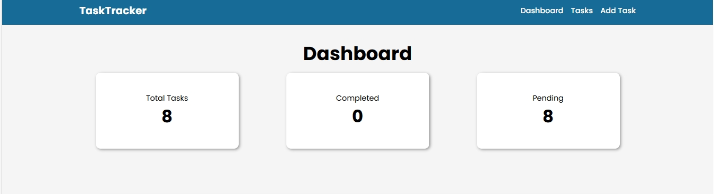
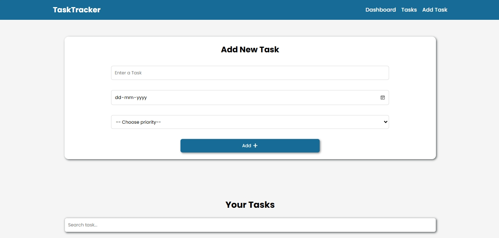
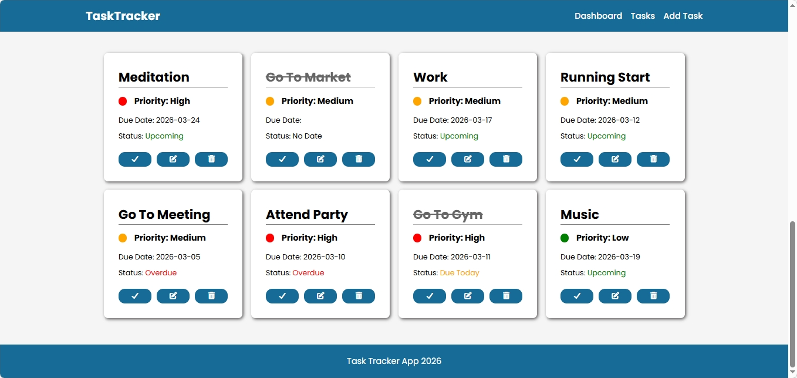
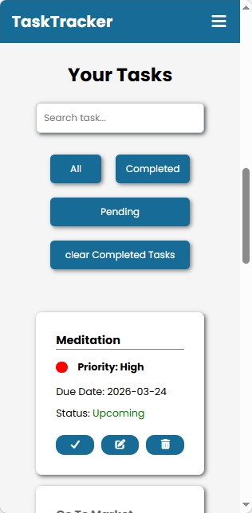
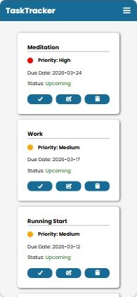
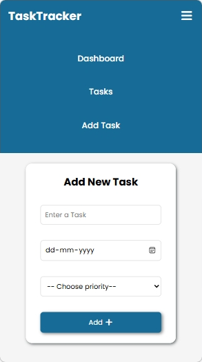

# Task Tracker App
A simple and responsive **Task Tracker** built with **HTML, CSS, and JavaScript**.  
It allows you to **add, edit, delete, and manage tasks** efficiently. All tasks are saved in **localStorage**, so they remain even after refreshing the page.

## Features
- Add new tasks with **title, due date, and priority**  
- Edit or delete tasks  
- Mark tasks as **completed**  
- Search tasks quickly  
- Filter tasks: All / Completed / Pending  
- Dashboard shows **total, completed, and pending tasks**  
- Responsive design for **mobile, tablet, and desktop**  
- Tasks stored in localStorage
  
## Screenshots
  
  

## How to Use
1. Open `index.html` in your browser  
2. Add, edit, delete, or complete tasks using the buttons  
3. Use search and filters to manage tasks
   
## Technologies
- HTML5, CSS3, JavaScript (ES6)  
- LocalStorage for task persistence.  

## Live Demo
 [View Live](https://nandini2003-tech.github.io/Advanced-Task-Tracker-App/)

## Author
Nandini

- GitHub: [Nandini2003-tech](https://github.com/Nandini2003-tech)  
- LinkedIn: [Nandini-tech](https://linkedin.com/in/nandini-t-35a125346)
